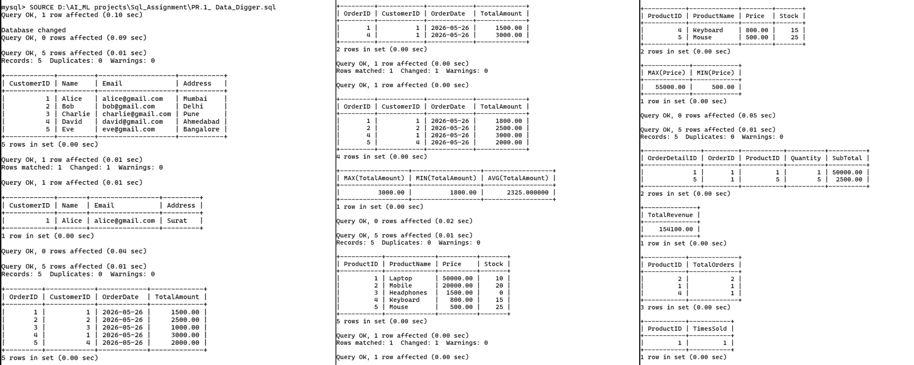

# 🚀 SQL Data Digger

A beginner-friendly SQL project focused on database operations, data management, and query analysis concepts.

## 📌 About This Project
This repository contains:
- Database creation
- Table creation and data insertion
- CRUD operations
- SQL queries
- Aggregate functions
- Data analysis concepts
- Beginner-friendly database exercises

## 📂 Files Included
- `PR.1_Data_Digger.sql` → SQL file containing database queries and operations
- `PR.1_Data_Digger_Output.png` → Output screenshot of SQL query execution

## 🛠 Technologies Used
- SQL
- MySQL

## 🎯 Learning Goals
This project helps in understanding:
- Database design concepts
- SQL query execution
- CRUD operations
- Aggregate functions
- Data handling and analysis

## 📸 Project Output

## 👨‍💻 Author
**Yashraj Sharma**

---
⭐ If you like this project, don't forget to star the repository.
